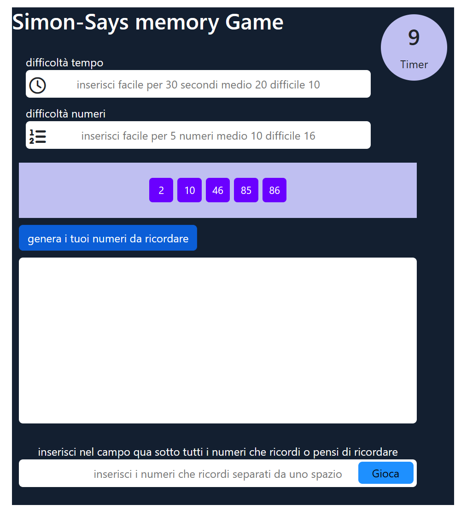
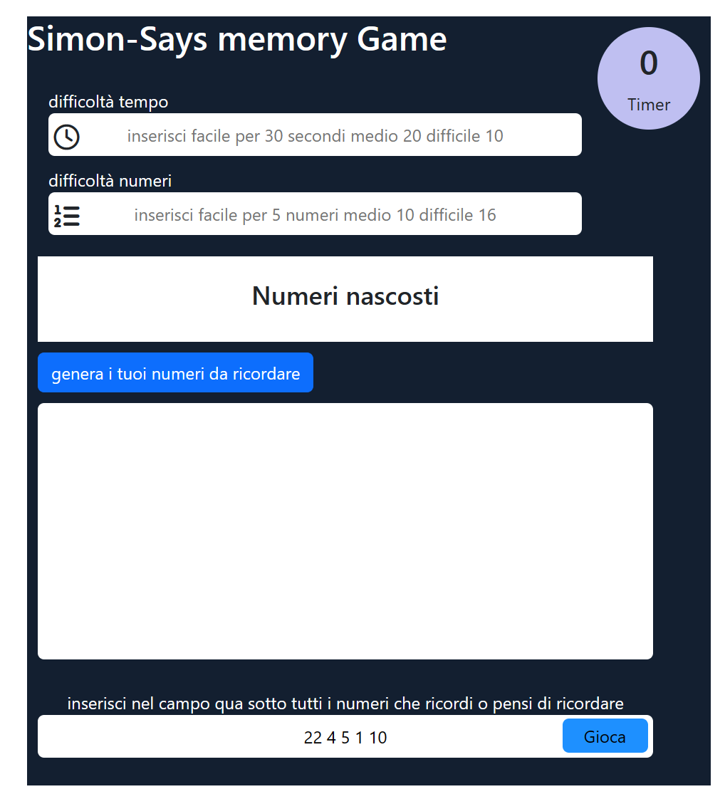
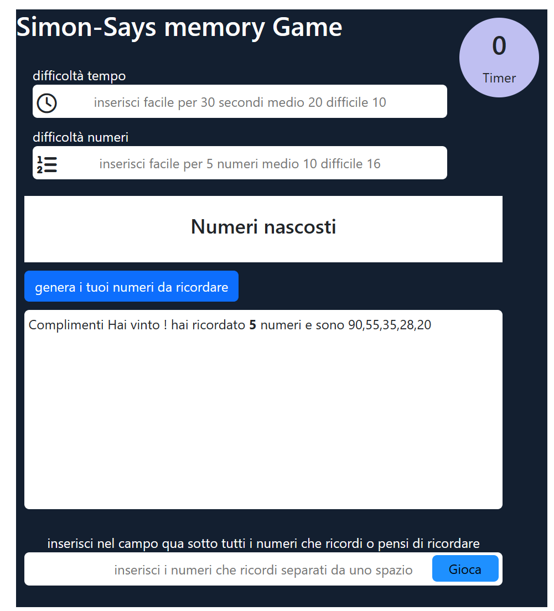

#All'avvio del gioco partira' un timer che mostrerà dei numeri per tot secondi (esempio 15)
 al termine dell'countdown i numeri spariranno e l'utente/giocatore
dovrà ricordare tutti i numeri usciti per vincere la partita 
carico in aggiunta due foto del programma 

#ho riscritto la mia app da zero prima non mi piaceva ora è graficamente e logicamente più avanzata
!
.
.
.
.